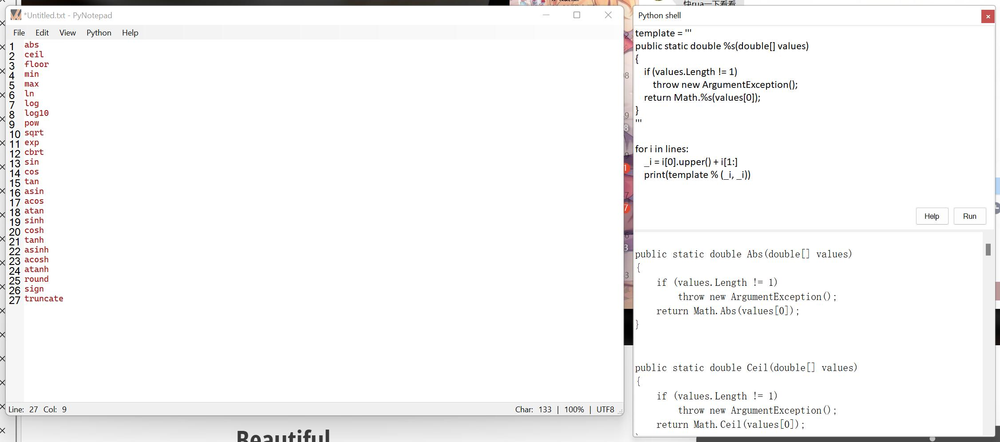

# Null.PyNotepad

A simple text editor by C#, you can use Python to operate text in this editor
一个由C#编写的简单编辑器, 你可以在这个编辑器中使用Python来操作文本

You can also use it to quickly generate some duplicate code
你也可以使用它来快速生成一些重复的代码

